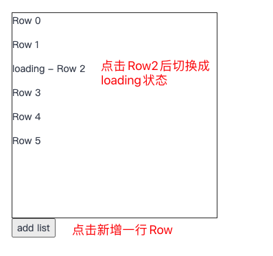
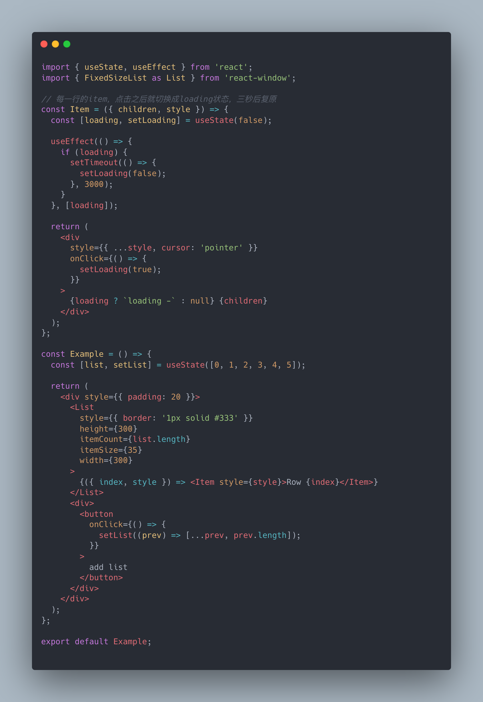
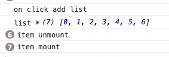
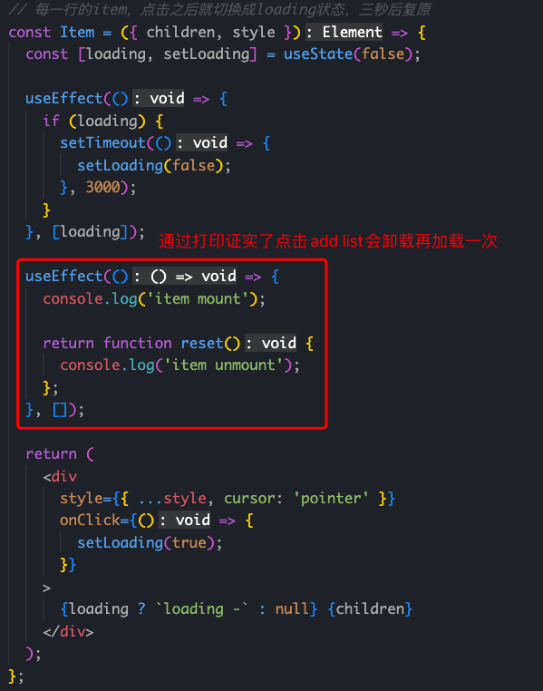
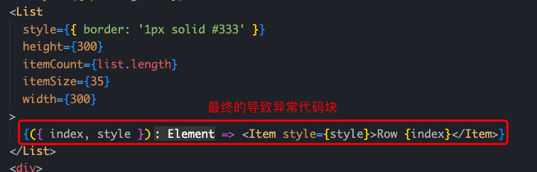
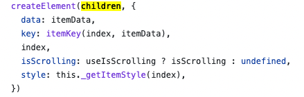
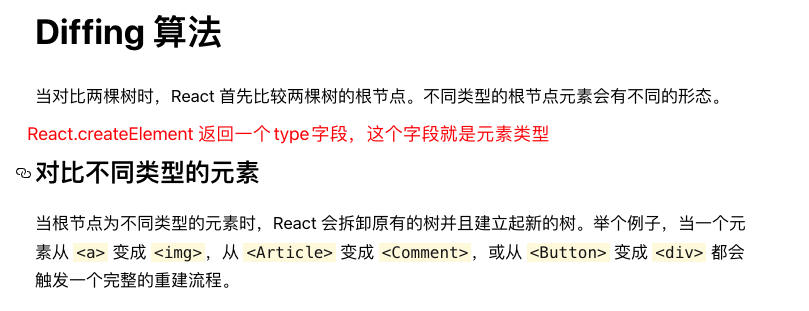
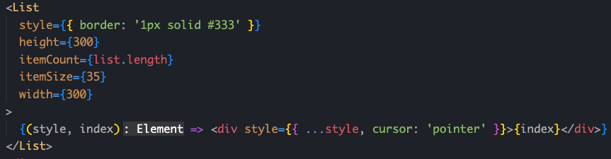
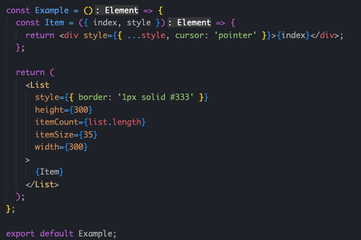
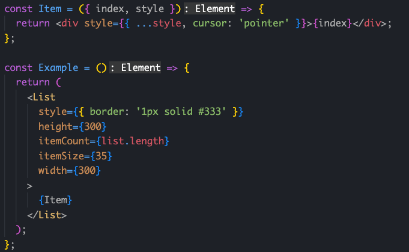

# React踩坑记录-使用react-window的异常卸载问题

## 问题背景

### 现有交互需求

1. 列表内元素可以通过界面交互添加
2. 列表内元素点击切换loading状态，三秒后自动复原

### 其中交互图如下

### 实现代码块

| 代码                                         | 运行效果                                       |
| -------------------------------------------- | ---------------------------------------------- |
|  | [ |

很明显看的出来，**在新增一行的情况下，loading中的元素直接被重置掉了**

## 问题定位

| 过程                                                                                                                                                  | 图                                                                                     |
| ----------------------------------------------------------------------------------------------------------------------------------------------------- | -------------------------------------------------------------------------------------- |
| 由于loading直接被重置掉了，首先就怀疑列表元素是否被卸载导致了这种现象。同时也通过测试证实了这个点，每次点击`add list`的确把所有的`Item`卸载有加载了。 |  |
| 再经过简单的排查，就很快定位到的异常的代码块了，很明显是由于list变更触发render，重新执行了这个匿名函数，触发了组件卸载。                              |                                             |

## Why

定位到问题后，就立马产生疑惑了，这不都是相同的组件吗，数据也仅做了增量，新增一个Item而已，为何就触发卸载卸载了，这是由于变更了list的长度内容，`react-window`是不是存在需要重新计算虚拟滚动相关的数据导致了触发组件卸载了。这应该就是`react-window`自身的bug吧。

## 深入探索问题原因

由于怀疑react-window，所以先去github看看react-window相关模块的代码，看看传入children这一块做了什么事情，很快通过翻阅代码发现了一个点，react-window是通过`React.createElement`创建传入的子元素的，所以基本上可以断定是React机制上引起的卸载了。

`React.createElement`只是做了一个生成react的实例，所以很有可能是匿名函数式的传入，导致了不断创造新的组件，从而引起了加载和卸载的流程，从react官方的描述上也能很清楚的看出这一点。**create传入匿名函数返回的type每次都是一个新的引用地址，所以在diff算法里面，一直都是不同元素，导致了这个现象的发生**。

## 如何解决

解决办法很简单，把匿名函数写法改成正常声明组件的写法传入即可

## 总结&后续建议

不要使用匿名函数的方式作为children使用，因为组件内部怎么处理这个children的行为是未知的，这种代码块是存在性能隐患的。而从code-review上很难看出问题，要不是这次结合了子组件自己做了内部状态管理同时有交互触发父组件的更新，根本上发现不了这种隐患问题，所以后续从code-review规范上要落实一点，**不能把匿名函数作为children使用**。

### bad case

直接使用匿名函数作为`children`传入

函数内运行时声明组件也会触发类似同样结果

### good case

提前声明组件，作为唯一实例传入

